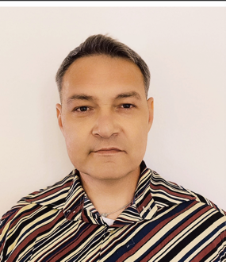

# QA Engineer & Developer in Test Portfolio

Welcome to my official portfolio repository! This repository contains the source code for my single-page responsive portfolio website, showcasing my skills, automated/manual testing workflows, and professional projects.

## 🛠️ Tech Stack & Core Competencies

* **Frontend:** HTML5, CSS3 (Modern Flexbox & Grid layouts), FontAwesome
* **Programming Languages:** Python, JavaScript, Java
* **QA & Testing Methodologies:** STLC (Software Testing Life Cycle), Test Case Design, Defect Lifecycle Management, Manual Testing, Test Automation
* **Tools & DevOps:** Jira (Scrum/Kanban management), Azure DevOps, Postman (API Testing), Jenkins (CI/CD Pipelines), Git & GitHub, SQL/SQLite

## 🎯 Professional Game Testing Workflow

A key focus of my QA approach is ensuring structured and bulletproof quality assurance within gaming environments. My workflow guarantees high-quality bug tracking through:

1. **Evidence Gathering:** Generating precise video recordings and screenshots for every encountered defect to ensure quick reproducibility.
2. **Comprehensive Documentation:** Delivering structured bug reports featuring exact definitions of **Actual Results** versus **Expected Results**.

## 🚀 Deployment & Development

* **IDE:** Developed entirely using JetBrains PyCharm.
* **Hosting:** Automatically built and hosted on Netlify.
* **Optimization:** Fully responsive and optimized for modern desktop and mobile browsers.

---
*Continuous Learning Focus: Currently preparing for the ISTQB Certified Tester certification to further advance my professional capabilities.*